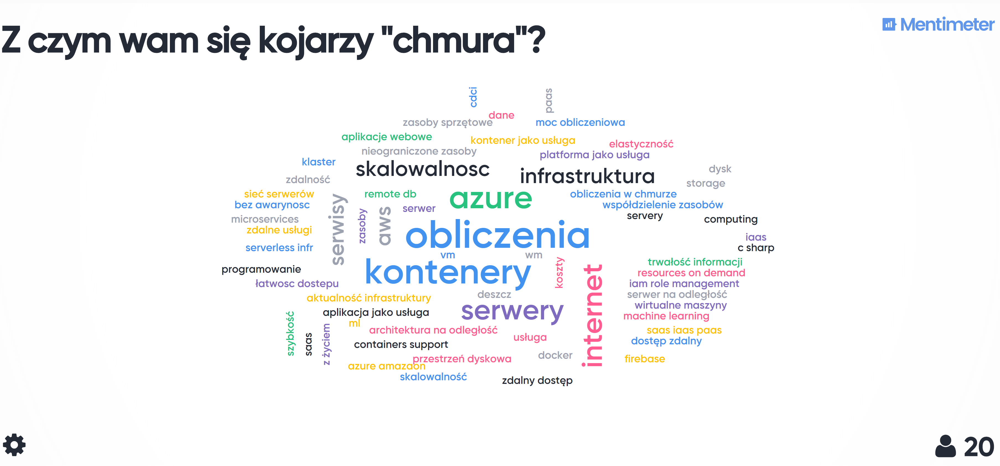

# Cloud computing
1DI2338: Programowanie usług w chmurze / Cloud computing couse at Warsaw University of Technology

## 19.03
1. Teoria:  M01: Cloud concepts && M02: Core Azure services
1. LAB - 5p:
    - START YOUR FIRST LINUX VIRTUAL MACHINE ON AZURE;
        - Main scenario: https://docs.microsoft.com/en-us/learn/modules/create-linux-virtual-machine-in-azure/
        - Extra resources:
            - https://www.youtube.com/watch?v=fnqCSQ3WGTw
            - https://docs.microsoft.com/pl-pl/azure/virtual-machines/linux/quick-create-cli
    - Sprawozdanie (w formie video) ma zawierać:
        - Nazwa: "Lab 01 - Moja pierwsza wirtualna maszyna na Azure - Programowanie usług w chmurze"
        - Pokazanie logowania do Azure Portal
        - Wszystkie kroki, które są efektem "Main scenario" ( w tym zalogowanie się po SSH); omówienie networking; omówienie pierwszych pięciu głównych zakładek + wszystkie zakładki z Settings.
    - Proszę usunąć VMke na koniec
1. 


## 26.03
1. Teoria - M03: Security, privacy, compliance, and trust
1. Omowienie labów
1. Wybór labów - [deklaracja per osoba](https://bit.ly/33FiI6q) - do 29.03.2020 23:59.
1. LAB - 10p
    - [App modernization](https://github.com/microsoft/MCW-App-modernization/blob/master/Hands-on%20lab/HOL%20step-by-step%20-%20App%20modernization.md)
        - [before the hands-on lab setup guide](https://github.com/microsoft/MCW-App-modernization/blob/master/Hands-on%20lab/Before%20the%20HOL%20-%20App%20modernization.md)
        - [Manual resource setup guide](https://github.com/microsoft/MCW-App-modernization/blob/master/Hands-on%20lab/Manual-resource-setup.md)
        - [App Modernization with Microsoft Azure : Build 2018 - General concepts](https://www.youtube.com/watch?v=kcHhMjymt_0)
    - [Intelligent analytics](https://github.com/microsoft/MCW-Intelligent-analytics/blob/master/Hands-on%20lab/HOL%20step-by-step%20-%20Intelligent%20analytics.md)
        - [before the hands-on lab setup guide](https://github.com/microsoft/MCW-Intelligent-analytics/blob/master/Hands-on%20lab/Before%20the%20HOL%20-%20Intelligent%20analytics.md)
    - Sprawozdanie (w formie video) ma zawierać:
        - Nazwa: "Lab 02 - "nazwa laba" - Programowanie usług w chmurze"
        - Cel danego laba
        - Pokazanie logowania studenta do Azure Portal
        - Wszystkie kroki, które są *efektem* wykonania labu plus:
            - Opis architektury z uwzględnieniem odpowiedzialności każdego elementu z diagramu:
                - App modernization - https://github.com/microsoft/MCW-App-modernization/raw/master/Hands-on%20lab/media/preferred-solution-architecture.png
                - Intelligent analytics - https://github.com/microsoft/MCW-Intelligent-analytics/raw/master/Hands-on%20lab/media/preferred-solution-architecture2.png
            - Jeśli student będzie miał problem w czasie realizacji Exercise/Task i nie uda mu się dokończyć laboratorium z powodu tego problemu wymagany jest opis: czego nie udało się zrealizować, root cause problemu, potencjalny workaround i powód, dla którego ten workaround nie może zostać wykonany.
        - Wnioski z laboratorium w tym przykładowe zastosowanie zbudowanego systemu
    - Proszę pamiętać o usunięciu Resource Groups z zasobami, po zrealizowanym labie (Optymalizacja zużycia dostępnych kredytów)
1. Dodatkowe ogłoszenie
```
Pandemia koronawirusa sprawia, że dużo sektorów zostało zmuszonych do cyfrowej transformacji [1].

Przez to datacenters Microsoftu są mocno obłożone mówiąc delikatnie. Szczególnie w dwóch regionach: Europa i USA, w których brakuje zasobów obliczeniowych.

Z tego powodu Microsoft wyłącza możliwość stawiania niektórych zasobów (tych najbardziej kosztowych pod względem potrzebnej infrastruktury) w pierwszej kolejności dla kont, które nie są podpięte jako płatnicy (Pay as you go). To powoduje, że mogą być blokady w provisioningu np. Azure SQL Db. [2 , 3]. Co będzie dalej - niestety nie wiadomo. Nie mam dostępu do listy zasobów już zablokowanych. 

Jak to wpływa na laboratorium / projekt:
- proszę się upewnić, że włączyliście możliwość provisioningu danego typu zasobu w ramach subskrypcji [4]
- jeśli nie możecie postawić SQL DB to albo możecie zastąpić tę bazę np. poprzez Azure PostgreSQL albo w przypadku labu nr 2 - zrobić lab "Intelligent analytics". 


[1] https://www.reddit.com/r/sysadmin/comments/fry2b7/who_accelerated_digital_transformation_in_your/
[2] https://social.technet.microsoft.com/Forums/azure/en-US/461b4364-1d76-4537-9f8e-3eb60d2ca137/create-sql-database-server-location-africa-south-africa-north?forum=ssdsgetstarted
[3] https://social.technet.microsoft.com/Forums/en-US/ac0376cb-2a0e-4dc2-a52c-d986989e6801/unable-to-create-sql-database-server?forum=ssdsgetstarted
[4] https://docs.microsoft.com/en-us/azure/azure-resource-manager/management/resource-providers-and-types

```

## 02.04
1. Teoria - M04 - 
1. Pomoc przy labach

## 9.04
1. Teoria - M04
1. Omowienie labów
1. Wybór labów
1. LAB - 10p
- [Serverless architecture](https://github.com/microsoft/MCW-Serverless-architecture/blob/master/Hands-on%20lab/HOL%20step-by-step%20-%20Serverless%20architecture.md) ([Before labs](https://github.com/microsoft/MCW-Serverless-architecture/blob/master/Hands-on%20lab/Before%20the%20HOL%20-%20Serverless%20architecture.md))
- [Cognitive services and deep learning](https://github.com/microsoft/MCW-Cognitive-services-and-deep-learning/tree/master/Hands-on%20lab) && ([Media AI](https://github.com/microsoft/MCW-Media-AI/tree/master/Hands-on%20lab) or [Internet of Things](https://github.com/microsoft/MCW-Internet-of-Things/tree/master/Hands-on%20lab))
- Uwaga - tego labu nie usuwamy. Będzie on sprawdzany. 

## 16.04
1. Omowienie labów
1. Pomoc przy labach
1. Test wiedzy (poziom AZ-900); 10p
    - najlepsi ("N" liczba) dostaną voucher na egzamin

## 23.04
1. Omowienie labu
1. LAB - 10p - [Kubernetes in action on Azure The Azure Kubernetes Workshop](https://aksworkshop.io/)

## 30.04
1. Pomoc przy labach

## Inne ogłoszenia
- Sprawdznie obecności odbywa się na początku zajęć (teoria, wytłumaczenie labów, wybór labów - część obowiązkowa)
- Sprawozdanie jest wykonywanie w formie video publikowane na YT (publiczne/prywatne)
- Link do video przesyłany jest za pomocą specjalnego formularza udostępnionego dla każdego laba
- Publikują Państwo wszystkie video z Państwa konta na YT, od poczatku do konca jedno konto
- długość 3-10 minut (to wymaganie może ulec zmianie w zależności od labu)
- Sprawdzana będzie data i godzina, kiedy film został opublikowany
- Deadline na publikacje, to 1h przed kolejnymi zajęciami, na których nowe laby są prezentowane
- Za sprawozdanie udostępnione/zuploadowane po terminie (maksymalnie do 7d) można uzyskać połowę punktów
- Za sprawozdanie udostępnione/zuploadowane po terminie (powyżej 7d) nie są przyznawane punkty
- Podejrzenie (samo podejrzenie) o niesamodzielności wykonania zadania (labu) jest podstawą do wyzerowania wszystkich labów i wystawienia "Nzal"
- Szczerość, Zaufanie
- Picie kawy i innych napoi w czasie zajęć - na własną odpowiedzialność ;) 
- Najlepsze prace (kilka) z każego labu może zostać podlinkowane do tego repozytorium

## Oddawanie Labu 
- http://bit.ly/2WohDOK (7:15 przed kolejnymi zajęciami)

## Ocena z laboratorium
- Max 35p z hands-on labs
- Max 10p test wiedzy
- Suma Max 45p
- Oceny (procentowo)
```
<51; 60) % 3
<61; 70) % 3.5
<71; 80) % 4
<81; 90) % 4.5
>= 91% 5

+ extra 10p za zdanie egzaminu AZ-900
```

## Przypomnienie regulaminu kursu
- Nieobecność:
Warunkiem udziału w kursie jest znajomość języka angielskiego umożliwiająca lekturę dokumentacji technicznej.
W uzasadnionych i udokumentowanych wypadkach prowadzący zajęcia może usprawiedliwić nieobecność studenta na podstawie jego prośby o usprawiedliwienie nieobecności. Dopuszcza się jedną usprawiedliwioną nieobecność studenta w czasie semestru pod warunkiem uzupełnienia materiału zajęć z inną grupą lub na wyznaczonych przez Kierownika zajęciach dodatkowych. Większa liczba nieobecności skutkuje niezaliczeniem zajęć.
Prowadzący zajęcia ma prawo odmówić usprawiedliwienia nieobecności na zajęciach, jeśli uzna, że przyczyna nieobecności nie jest zasadna lub wystarczająco udokumentowana.
- Cel przedmiotu
Celem przedmiotu jest nauczenie zasad tworzenia aplikacji we współczesnych środowiskach chmurowych. Przedmiot przedstawia zasady korzystania i budowania usług w środowiskach rozproszonych oraz tworzenia aplikacji korzystających z usług. Student po ukończeniu zajęć powinien znać różne rodzaje technologii chmurowych, zasady projektowania architektur usługowych oraz potrafić stworzyć oraz wdrożyć system oprogramowania w środowisku chmurowym.
- Zaliczenie
Warunkiem zaliczenia ćwiczeń jest uzyskanie co najmniej 51% pkt.


# PROJEKT
- 19.03 - Intro; zlaszanie tematow w ciagu tygodnia; podzial na grupy 5-6 osobowe; Podzial odpowiedzialnosci w grupie; Na koniec studenci oceniają się nawzajem
- 26.03 - I obowiązkowe review w grupach; 15min na grupę
- 2.04 - konsultacje online dla chętnych
- 9.04 - **II obowiązkowe review** (5p)
    - Studenci w swoich zespołach zobowiązani są przygotować na spotkanie:
        - Digaram z architekturą - użyte komponenty Azure. Proponowane narzędzia do wykonania diagramu: Visio, Draw.io.
        - Diagram przypadków użycia (funcje aplikacji/systemu/platformy)
        - Techniczne szczegóły (np. z jakiej sieci neuronowej będą korzystać i dlaczego; jaki język programowania i biblioteka)
        - Rozpisane zadania w dowolnym narzędziu (np. Trello, Jira, Azure DevOps, Asana, GitHub, Notatnik, Excel ... dowolne )
        - Założone repozytorium na GitHub
- 16.04 - konsultacje online dla chętnych
- 23.04 - konsultacje online dla chętnych
- 30.04 - konsultacje online dla chętnych
- 7.05 - **III obowiązkowe review** (5p)
- 14.05  - konsultacje online dla chętnych
- 21.05 - konsultacje online dla chętnych
- 28.05 - konsultacje online dla chętnych
- 4.06 - **Oddanie projektu** (40p)
- 11.06 - Wystawienie ocen

## Inspiracje projektowe
1. Wszystkie architektury realizowane w czasie labów
1. [Centrum architektury platformy Azure](https://docs.microsoft.com/pl-pl/azure/architecture/)
1. [Azure Blockchain](https://github.com/Microsoft/MCW-Azure-Blockchain)
1. [Azure security and management](https://github.com/Microsoft/MCW-Azure-Security-and-Management)
1. [Intelligent vending machines](https://github.com/Microsoft/MCW-Intelligent-Vending-Machines)
1. [Lift and shift/Azure Resource Manager](https://github.com/Microsoft/MCW-Lift-and-shift-Azure-Resource-Manager)
1. [Linux lift and shift](https://github.com/Microsoft/MCW-Linux-Lift-and-Shift)
1. [Microservices architecture](https://github.com/Microsoft/MCW-Microservices-Architecture)
1. [Mobile app innovation](https://github.com/Microsoft/MCW-Mobile-App-Innovation)
1. [Optimized architecture](https://github.com/Microsoft/MCW-Optimized-Architecture)
1. [OSS DevOps](https://github.com/Microsoft/MCW-OSS-DevOps)
1. [Securing PaaS](https://github.com/Microsoft/MCW-Securing-PaaS)
1. [Cloud native apps](https://github.com/microsoft/MCW-Cloud-native-applications/tree/master/Hands-on%20lab)

Polecam [wyszukiwanie architektur i warsztatów na GitHub](https://github.com/microsoft?q=MCW&type=&language=).


## Oddanie projektu
- Video na YT z prezentacją rozwiązania
- Github z opisanym sprawozdaniem i pełna dokumentacja

## Cel projektu
W ramach projektu studenci wykonują kompletny prosty system składający się z gotowych usług, usług napisanych przez studentów oraz aplikacji, która wykorzystuje usługi w chmurze. System jest uruchomiony na platformie chmurowej (PaaS) wybranej przez studentów.

## Ocena z projektu
- 10p review
- 40p projekt
- Oceny (procentowo)

```
<51; 60) % 3
<61; 70) % 3.5
<71; 80) % 4
<81; 90) % 4.5
>= 91% 5
```

# Komunikacja z prowadzącą

Komunikacja prowadząca-studenci odbywa się poprzez email: kote@ee.pw.edu.pl.

Osoby, które nie wiedzą lub mają trudności w pisaniu formalnych wiadomości do prowadzących, proszone są o zapoznanie się z artykułami:
- http://filologika.pl/porady-jezykowe/jak-pisac-maile-do-prowadzacych
- http://www.multimedia.univ.rzeszow.pl/?p=1350
- http://www.zaparzeciherbate.pl/jak-napisac-e-mail-do-wykladowcy/

## Konsultacje

Konsultacje online odbywają się we wtorki w godz. 16-19 po wcześniejszym zapisaniu się przez portal ISOD.


# Dodatkowe linki
- https://github.com/microsoft/computerscience/tree/master/Educator%20Resources/Complimentary%20Course%20Content
- https://azurecharts.com/overview
- https://github.com/fabragaMS/ADPE2E - Azure Data Platform End2End (V2)
- https://azuredevopsdemogenerator.azurewebsites.net
- https://szkolenie.szkolachmury.pl/azurespecjalizacja35624111
- [Azure Spring Cloud](https://azure.microsoft.com/pl-pl/blog/introducing-azure-spring-cloud-fully-managed-service-for-spring-boot-microservices/)
- [Spring on Azure integration documentation](https://docs.microsoft.com/en-us/azure/java/spring-framework/?view=azure-java-stable)
- [Face detection](https://docs.microsoft.com/en-au/azure/cognitive-services/face/)
    - [Demo w PYthonie](https://docs.microsoft.com/en-au/azure/cognitive-services/face/quickstarts/python)
- [Azure Databricks](https://docs.microsoft.com/en-us/azure/azure-databricks/)
- [Azure Machine Learning](https://docs.microsoft.com/pl-pl/azure/machine-learning/)
- [Azure Notebooks](https://docs.microsoft.com/pl-pl/azure/notebooks/tutorial-create-run-jupyter-notebook)
- https://azure.microsoft.com/pl-pl/pricing/calculator/
- https://github.com/SpektraSystems/Infrastructure-as-Code
- [Azure Machine Learning Service Labs](https://github.com/solliancenet/azure-machine-learning-service-labs)
